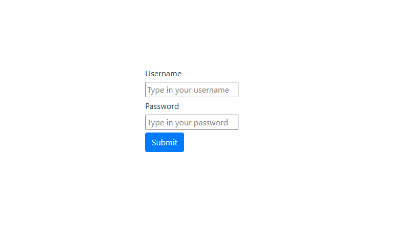

# Store (E-Commerce) 

Store is an e-commerce that uses Spring Boot, Spring Data, Spring Boot Test with JUnit and authentication with MD5 encryption.


#### How the API works

Adding a client:

```
POST /api/clients
```

```json

{
  "name": "Nathan",
  "lastName": "Drake",
  "birthday": "2000-01-01",
  "gender": "MALE",
  "userName": "nathan_drake",
  "password": "uncharted",
  "email": "nathan_drake@gmail.com",
  "country": "USA"
}
```

Constraints:

* Username can't be over 30 characters.
* Password can't be over 100 characters.
* Birthday format pattern "yyyy-MM-dd".

Adding a product:

```
POST /api/products
```

```json
{
  "name": "Chair",
  "price": 22.30
}
```

Adding an order

Note: you should use data that is stored in the database in order to create an order, otherwise you can't.

To retrieve data from the database these are the endpoints:

````
GET /api/clients/all
GET /api/products/all
GET /api/orders/all
```

```
POST /api/orders
```

```json
{
  "orderProducts" : [

	{
		"id": 1,
		"dateCreated": "2020-07-06T13:38:05.590934",
		"name": "Chair",
		"price": 22.30,
		"availability": "AVAILABLE"
		},
	{
		"id": 2,
		"dateCreated": "2020-07-06T13:38:06.394944",
		"name": "Table",
		"price": 60.00,
		"availability": "AVAILABLE"
		}
   ],
      "client":{
			"id": 1,
			"dateCreated": "2020-07-06T13:38:19.1489721",
			"name": "Nathan",
			"lastName": "Drake",
			"birthday": "2000-01-01",
			"gender": "MALE",
			"userName": "nathan_drake",
			"email": "nathan_drake@gmail.com",
			"country": "USA"
	}
}
```

#### Authenticating user

To authenticate a client in the website you can use a browser.
Submit a request to /login. You should make sure the username and password are correct.



The password is stored in the database with an MD5 algorithm, but to authenticate you should use the password without encryption.

After successfully authenticating you should be able to see all the user's orders and as well as his info.


#### Docker 

Building the docker image:

```
docker build -t ecommerce/store:1.0.0 .
```

Then you can run it with docker-compose with the following command:

```
docker-compose up -d
```